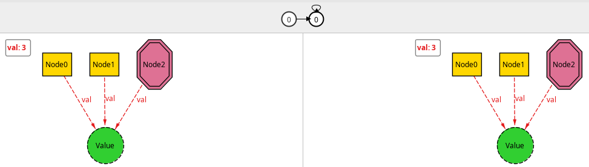
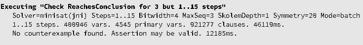
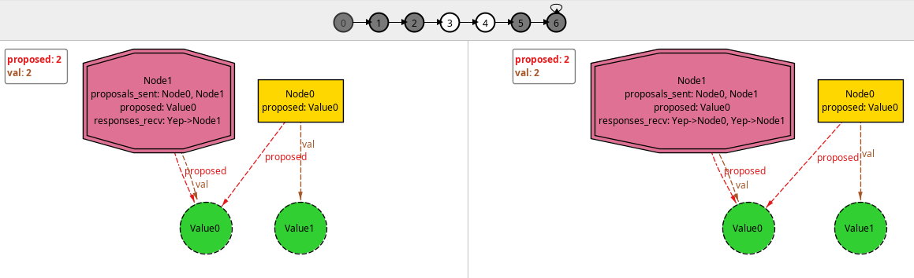

---
title: Simple Two-Phase Commit Exercise in Alloy 6
tags: alloy, formal methods, distributed systems
...

I wanted to learn how to use `Alloy <https://alloytools.org/>`_ 6's
new `temporal operators <https://www.hillelwayne.com/post/alloy6/>`_
and have a sense of how they worked for modelling protocol stuff.  I
found `Haslab's awesome tutorial
<https://haslab.github.io/formal-software-design/overview/index.html>`_
that gave me the basics to try to do a simple exercise: model
`two-phase commit
<https://en.wikipedia.org/wiki/Two-phase_commit_protocol>`_, then
visualize and check some things about it.

I still have a very long way ahead of learning formal methods.  The
model is certainly far from optimal, and I probably made mistakes
along the way.  So, as always, take the following with a grain of
salt.

The two-phase commit (*2PC*) is a protocol that attempts to solve the
problem of a group of nodes or processes trying to reach consensus if
a certain transaction should be committed or aborted.  In 2PC, one of
the participating nodes is designated as the *transaction coordinator*
(*TC*) and it is responsible for doing all the communications with the
other nodes.

The first phase of the protocol can be represented as the TC sending
to the participating nodes the transaction operations that need to be
done, and it expects its peers to answer whether they are willing to
commit those operations.  If any node responds with a "no", then the
TC sends a message to all nodes aborting the transaction.  Otherwise,
it tells the peers to commit.  It is a protocol that requires some
assumptions on the kinds of failures that can happen so that
properties like termination/liveness can be asserted.

In this particular model, I did not take crashes with reboot into
account.  Not only it's simpler, but I also don't know how to model
that.  Maybe a step that resets the "memory" of the node, and then add
steps to write and read the write-ahead log?  Also, this model
considers only one transaction.  In the future, I could try to take
concurrent transactions into account somehow.

I modeled the problem as each node having one ``Value``, which I use
to represent the local state of the ``Node`` regarding the history of
transactions.  Each node may have a proposed ``Value``, whose presence
represents the final state in case the transaction is committed.  It
also may have stated its ``Vote`` about it should commit or abort the
transaction (``Yep`` and ``Nope``, respectively).

.. code-block:: alloy

  module twophasecommit_ideal

  sig Value {}

  enum Vote {Yep, Nope}

  sig Node {
     var val: one Value,
     var proposed: lone Value,
     var voted: lone Vote
  }

The relations annotated with ``var`` are those that'll be allowed to
vary with each step of the analysis.

One of the nodes is the ``TransactionCoordinator``, which keeps track
of the proposals and responses it sent (``proposals_sent`` and
``responses_recv``, respectively).

.. code-block:: alloy

  one sig TransactionCoordinator in Node {
     var proposals_sent: set Node,
     var responses_recv: Vote -> Node
  }

Unless specified, the system so far is allowed to have any starting
relations and cardinality (constrained only to the cardinality and set
inclusion annotations).  So, we must specify what constitutes a valid
initial state, time-wise.  In the beginning, there are no values
proposed, no requests nor responses exchanged, and no votes.

.. code-block:: alloy

  fact init {
     no proposed
     no proposals_sent
     no voted
     no responses_recv
  }

Then, we may specify the possible "steps" that change the whole state
of system.  The simplest one is that in which nothing changes:
``stutter``.  It can represent either that the system is in a final
state or maybe some participants crashed and the system is unable to
make progress.

.. code-block:: alloy

  pred stutter {
     val' = val
     proposed' = proposed
     proposals_sent' = proposals_sent
     voted' = voted
     responses_recv' = responses_recv
  }

The primes in the relations' names indicate that it's the relation
value in the *next* step.  The first real step of the protocol
consists of the TC sending its proposal to the peers.  Here, the TC
sets its own proposed value to the value it is proposing to the other
node, meaning they should agree on the same final outcome.  It then
registers that it sent a proposal to the given node, which I think
could represent it writing the request to a write-ahead log (*WAL*)
before sending it.

.. code-block:: alloy

  pred send_proposal[tc: TransactionCoordinator, v: Value, n : Node] {
     // precondition: this node did not receive a proposal yet
     n not in tc.proposals_sent

     // effect
     tc.val = v
     tc.proposed' = v
     tc.proposals_sent' = tc.proposals_sent + n
     proposed' = proposed + n->v

     // frame conditions
     val' = val
     voted' = voted
     responses_recv' = responses_recv
  }

We need to specify some precondition for such step to take place, then
the desired effect on the state.  As with the initial state, anything
we don't specify is allowed to change freely.  Since it doesn't make
sense for the other nodes to suddenly vote before even receiving a
proposal, for example, we need to specify the *frame conditions* to
explicitly say that "everything else is unchanged".

The other steps are quite similar, with their own preconditions and
effects, as described above.  I've represented the decision of commit
or abort taking effect in the nodes as each one clearing the proposed
value from their memory, and then changing their own value in case of
a commit.

.. code-block:: alloy

  pred send_response[tc: TransactionCoordinator, vote: Vote, n : Node] {
     // preconditions
     no n.voted
     some n.proposed

     // effect
     n.voted' = vote
     tc.responses_recv' = tc.responses_recv + vote->n

     // frame conditions
     val' = val
     proposed' = proposed
     proposals_sent' = proposals_sent
     all m : Node - n | m.voted' = m.voted
  }

  pred send_decision_abort[tc: TransactionCoordinator, n: Node] {
     // preconditions
     all m : Node | some tc.responses_recv.m
     some m : Node | tc.responses_recv.m = Nope

     // effect
     val' = val
     proposed' = proposed - n->Value

     // frame conditions
     voted' = voted
     proposals_sent' = proposals_sent
     responses_recv' = responses_recv
  }

  pred send_decision_commit[tc: TransactionCoordinator, n: Node] {
     // preconditions
     all m : Node | tc.responses_recv.m = Yep
     some n.proposed

     // effect
     n.val' = n.proposed
     all m : Node - n | {
        m.val' = m.val
     }
     proposed' = proposed - n->Value

     // frame conditions
     voted' = voted
     proposals_sent' = proposals_sent
     responses_recv' = responses_recv
  }

We then say that those are possible steps in our system:

.. code-block:: alloy

  fact step {
     always (
       stutter or
       (some v: Value, n : Node, tc: TransactionCoordinator |
          send_proposal[tc, v, n]) or
       (some vote: Vote, n : Node, tc: TransactionCoordinator |
          send_response[tc, vote, n]) or
       (some n: Node, tc: TransactionCoordinator |
          send_decision_abort[tc, n]) or
       (some n: Node, tc: TransactionCoordinator |
          send_decision_commit[tc, n])
     )
  }

With ``always``, we specify that at all state transitions, one of these
possibilities must happen.  With this, we may already explore the
model and ask Alloy to generate some examples for us!

.. code-block:: alloy

  run example0 {
    #Node > 1
  }

When I ran this, I got a trace with a single distinct state: a single
node and the TC with the same initial state, and then stays forever
like that.  We can then manually ask the simulator to give us
different possibilities and explore if our model makes sense.  While
making the above predicates, I made several mistakes that the
visualizer showed me while exploring.  I'll defer the description of
each button of the visualizer to `Haslab's tutorial
<https://haslab.github.io/formal-software-design/overview/index.html>`_.
But the quick tip is to change the initial (non-``var`` relations) with
"New Config", then proceed to the next state until you want a new next
state, at which point you click "New Fork" to produce a new one.
Rinse and repeat.

We may try to assert some temporal properties of our system.  We want
it to eventually reach some conclusion about the transaction: either
abort or commit it.  That final state is represented here as all nodes
having received some proposal, sent their responses back, and then
having cleared their pending proposals.

.. code-block:: alloy

  pred ReachesConclusion {
     Node = TransactionCoordinator.proposals_sent
     all m : Node | some TransactionCoordinator.responses_recv.m
     no proposed
  }
  assert ReachesConclusion0 {
     eventually ReachesConclusion
  }
  check ReachesConclusion0 for 3 but 1..15 steps

As one could possibly expect, when we ask the model checks to verify
``ReachesConclusion0``, it immediately finds a counterexample.  The
system never makes progress, which could be that the TC crashes and
never comes back.

So, in order for our protocol to eventually reach some conclusion, we
need to impose some conditions on its behaviors.  In particular, we
may assume that, if a proposal is sent to a node, then eventually
it'll be received by the node.  I think that could be represented in a
real implementation as a retry mechanism on the TC side.  Analogously,
we may assume that eventually a response is eventually sent back, and
that a decision message is finally sent.  Without any those
assumption, the protocol halts at that step or phase.  At least that
was what I saw while playing with it.  This is what I believe is
referred to as a `fairness condition
<https://www.learntla.com/reference/glossary.html?highlight=fairness>`_.

.. code-block:: alloy

  pred fairness {
     all tc: TransactionCoordinator, n: Node | {
        (eventually historically (n not in tc.proposals_sent))
          => (eventually some v: Value, tc: TransactionCoordinator |
              send_proposal[tc, v, n])
        (eventually always (n in tc.proposals_sent))
          => (eventually some v: Vote, tc: TransactionCoordinator |
              send_response[tc, v, n])
        (eventually always (n in Vote.(tc.responses_recv)))
          => (eventually some tc: TransactionCoordinator |
              (send_decision_abort[tc, n] or send_decision_commit[tc, n]))
     }
  }

With that, we may rewrite the ``ReachesCondition`` predicate and
assertion as:

.. code-block:: alloy

  pred ReachesConclusion {
     Node = TransactionCoordinator.proposals_sent
     all m : Node | some TransactionCoordinator.responses_recv.m
     no proposed
  }

  assert ReachesConclusion {
     fairness => eventually ReachesConclusion
  }

  check ReachesConclusion for 3 but 1..15 steps

With this, no counterexample is found for ``ReachesConclusion``, so our
assertion *may* be valid!  🍾🎉

We may also assert another silly condition and run an example that
reaches some conclusion to visualize the steps the simulation takes.
An example is found within 7 steps.

.. code-block:: alloy

  pred Commited {
     ReachesConclusion
     all m : Node | m.voted = Yep
  }

  assert CommitMeansAgreement {
     Commited => all disj n1, n2 : Node | n1.val = n2.val
  }

  check CommitMeansAgreement for 3 but 1..15 steps

  run example {
     #Node > 1
     eventually ReachesConclusion
  }

  run commit_example {
     #Node > 1
     eventually {
        ReachesConclusion
        all m : Node | m.voted = Yep
     }
  }

  run abort_example {
     #Node > 1
     eventually {
        ReachesConclusion
        some m : Node | m.voted = Nope
     }
  }

And that's it!  I couldn't think of other properties and things to
check at the moment.  The only other thing would perhaps be to
consider more simultaneous transactions or writing to disk.

While trying to write the fairness condition, though, I found some
strange behaviors that I'm still trying to wrap my head around.  When
I initially wrote the first condition ("if a proposal has not yet been
sent to a node, one will eventually be sent"), I wrote it in the same
form as the one in Haslab's tutorial.  That is, in the form
``eventually always historically ... => always eventually ...``.  The
second and third were similar, regarding the ``=> always eventually``
part.  Then, playing with the examples and the conclusion assertion, I
noticed that I actually didn't need the third fairness condition,
which seemed very wrong.  For example, using the following fairness
condition is enough for the same ``ReachesConclusion`` assertion above
to be checked with no counterexamples.

.. code-block:: alloy

  pred strange_fairness {
     all tc: TransactionCoordinator, n: Node | {
        (eventually historically (n not in tc.proposals_sent))
          => (eventually some v: Value, tc: TransactionCoordinator |
              send_proposal[tc, v, n])
        (eventually always (n in tc.proposals_sent))
          => (eventually always some v: Vote, tc: TransactionCoordinator |
              send_response[tc, v, n])
     }
  }

Not that the only difference is that there's no third condition (about
sending the final decision), and I've added an ``always`` to the
consequent of the second condition (``eventually always some`` instead
of ``eventually some``).  I couldn't yet see why this is enough for
the conclusion to be reached...  Also why ``always`` is not needed (or
why it would be needed) in the antecedent of the first condition.

The full file for the model and the theme I used in the visualizer can
be found in this gist:

https://gist.github.com/thalesmg/3db6766585e2092fe05920d3c6f861cc
